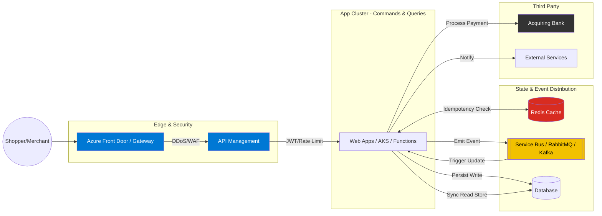

# 💳 Payment Gateway API

A simple, robust, decoupled - loosely coupled, independent deployable, scalable REST API built with **.NET 8** using the **CQRS (Command Query Responsibility Segregation)** pattern (without any library). This project is architected to handle high-volume payment processing for Shoppers and Merchants while maintaining a strict separation between data modification and data retrieval. 


## 🏗 Architectural Design

To ensure the system remains maintainable and ready for future microservices migration, we have manually implemented CQRS without heavy third-party libraries. 

### Why this approach?
* **Performance:** The Query side can be optimized for speed (e.g., using Dapper or Read-Replica DBs).
* **Scalability:** The `Command` and `Query` services are logically isolated, allowing them to be hosted as **separate instances** (microservices) in the future to handle asymmetric loads.
* **Reliability:** Changes to reporting logic (Queries) cannot break the payment processing logic (Commands).

---

## 📂 Project Structure

The project follows a "Service-per-Responsibility" structure to enforce the CQRS boundary:

```text
PaymentGateway.API/
├── Controllers/
    ├── PaymentsCommandController.cs    # Routes to Command Services
    ├── PaymentsQueryController.cs      # Routes to Query Services
│   └── V2/ # Future version with new features (3D Secure) in future
│       └── PaymentsCommandControllerV2.cs  # Routes to Command or Query Services
│       └── PaymentsQueryControllerV2.cs    # Routes to Command or Query Services
├── Services/
│   ├── Commands/                    # WRITE SIDE
│   │   ├── IPaymentCommandService.cs
│   │   └── PaymentCommandService.cs  # Business logic & Bank Integration
│   ├── Queries/                     # READ SIDE
│   │   ├── IPaymentQueryService.cs
│   │   └── PaymentQueryService.cs   # Fast data retrieval & Projections
│   └── External/
│       └── IAcquiringBankAdapter.cs  # Third-party bank communication
├── Models/
│   ├── Commands/                    # Request DTOs (ProcessPaymentRequest)
│   ├── Queries/                     # Response DTOs (PaymentStatusView)
│   └── Domain/                      # Core Database Entities
└── Program.cs                       # DI and API Versioning Configuration

```

---

## Infrastructure as Code (IaC) - Not testested ,it is only for demostrations but added for future microservices evolution
* **terraform** sample added in the `infrastructure` folder to provision the necessary Azure resources for hosting and scaling the API, including Azure Web Apps, Azure SQL Database, Azure Service Bus, and Azure API Management.
* **Helm** charts added in the `helm` folder to deploy the API and its dependencies (e.g., Redis, Message Broker) on Kubernetes clusters.
* **GitHub Actions** workflows added in the `.github/workflows` folder to automate the CI/CD pipeline, including building, testing, and deploying to Dev. (sample only)

## Integration tests with Bank Simulator
* The `Testcontainers` library is used to spin up a local instance of the bank simulator for integration testing. This allows us to test the full payment processing flow, including communication with the acquiring bank, without relying on external dependencies.
* Integration tests are located in the `test\PaymentGateway.Api.Integration.Tests` project.  

## Unit tests with Mocking
* The `Moq` library is used to mock dependencies in unit tests, allowing us to isolate the components under test and verify their behavior without relying on actual implementations of external services.
* Unit tests are located in the `test\PaymentGateway.Api.Unit.Tests` project.


## 🧩 High-Level Components

### 1. Shopper & Merchant (Actors)

* **Shopper:** Initiates `ProcessPaymentCommand` via the API.
* **Merchant:** Views transaction history via `GetPaymentStatusQuery`.

### 2. Payment Gateway (The Core)

Validates the request, secures card information, and orchestrates the flow between the command service and the bank.

### 3. Acquiring Bank (The Processor)

The external interface responsible for the actual movement of funds. It is integrated via an adapter in the **Infrastructure/External** layer.

---

## 🚀 API Usage & Versioning

The API uses **Header/URL Versioning**.

### Endpoints (Old routes for backward compatibility)

| Type | Method | Endpoint | Payload |
| --- | --- | --- | --- |
| **Command** | `POST` | `/api/payments` | `ProcessPaymentRequest` |
| **Query** | `GET` | `/api/payments/{id}` | Returns `PaymentStatusView` |


### V1 Endpoints

| Type | Method | Endpoint | Payload |
| --- | --- | --- | --- |
| **Command** | `POST` | `/api/v1/payments` | `ProcessPaymentRequest` |
| **Query** | `GET` | `/api/v1/payments/{id}` | Returns `PaymentStatusView` |

### V2 Roadmap (enhancement)

* V2 is for advanced features like 3D Secure 2.0 or Crypto payments by introducing `PaymentCommandServiceV2` without impacting legacy V1 integrations.
* Resiliency features (e.g.,Implement Polly policies for fallback, bulkhead, retry, circuit breaker, timeout, etc. ) can be added in V2 without affecting V1.
* Outbox pattern can be implemented in V2 to ensure reliable event publishing without affecting V1's synchronous flow.
* OpenTelemetry can be integrated in V2 for distributed tracing and monitoring without impacting V1's performance.
* API Gateway can be introduced in V2 to handle routing, authentication, rate limiting, IP whitelisting, and enhanced authentication mechanisms (e.g., OAuth2, OpenID Connect) to protect the API from abuse and unauthorized access without affecting V1's direct access pattern.

---

## 🛤 Future Evolution: Toward Microservices

Because we have split (`PaymentsCommandController` & `IPaymentCommandService`) and (`PaymentsQueryController` & `IPaymentQueryService`), moving to a distributed architecture is a "low-effort" task:

1. **Physical Split:** Move the Services into two different Web API projects.
    1. **API Gateway & Hosting:** Use an API Gateway (e.g., Azure API Management) to validate JWT tokens, Rate Limiting and  to route requests to the appropriate service based on the endpoint and version. For hosting, Kubernetes or Azure Web Apps/Functions can be used to host the Command and Query services independently, allowing for better scalability and fault isolation.
    2. **Kubernetes** or **Azure Web Apps Or Azure Function** can be used to host the Command and Query services independently, allowing for better scalability and fault isolation.    
    3. **highly available and scalable architecture:** Implementing load balancers, auto-scaling groups, and multi-region deployments to ensure high availability and low latency for global users.
2. **Idempotency:** Implement idempotency keys for Commands to ensure that retries do not cause duplicate transactions.
3. **Data Split:** Point the Query service to a Read-only replica or a NoSQL store (Redis/ElasticSearch).
4. **Async Syncing:** Use a Message Broker (RabbitMQ/Azure Service Bus) to update the Read-Store whenever a Command successfully completes.
5. **Monitoring & Logging:** Implement distributed tracing (OpenTelemetry) and centralized logging (ELK Stack/Azure Monitor) to track requests across services.  
6. **WAF and DDoS Protection**: Implement Web Application Firewall (WAF) rules, Vulnerability and DDoS protection to safeguard the API from malicious traffic.
7. **Modularization:** As the system grows, we can further modularize the services (e.g., separate microservices for Payment Processing (seprate POD/Instances for each Bank or Card Provider), Fraud Detection, Notification, etc.) while maintaining clear boundaries and communication patterns.

---

## 🛠 Tech Stack

* **Framework:** ASP.NET Core 8.0
* **Database:** Entity Framework Core, Dapper, SQL Server / PostgreSQL/ Cosmos DB (depending on your choice in the implementation)
* **Versioning:** Asp.Versioning.Http
* **Documentation:** Swagger / OpenAPI
* **Testing:** xUnit / Moq
* **CI/CD:** GitHub Actions / Azure DevOps (for future microservices evolution)
* **infrastructure as code:** Terraform/ Bicep / Azure Resource Manager (for future microservices evolution)
* **Containerization:** Docker/ Podman/Rancher (for the bank simulator or other container local developement)
* **Messaging:** Azure Service Bus / RabbitMQ/ Kafka(?) (for future microservices evolution)
* **Caching:** Redis (for idempotency and performance optimization)
* **Alterting && Monitoring:** OpenTelemetry / Azure Monitor (for future microservices evolution)
* **Logging & Tracing:** Azure App insight/OpenTelemetry/  Serilog / ELK Stack (for future microservices evolution)
* **Security:** JWT Authentication, Azure Front Door (for future microservices evolution)
* **Secrets Management:** Azure Key Vault (for future microservices evolution)
* **API Gateway:** Azure API Management (for future microservices evolution)
* **Hosting:** Azure Web Apps/ Azure Functions / Kubernetes (for future microservices evolution)


## 📊 Target System Architecture Diagram

